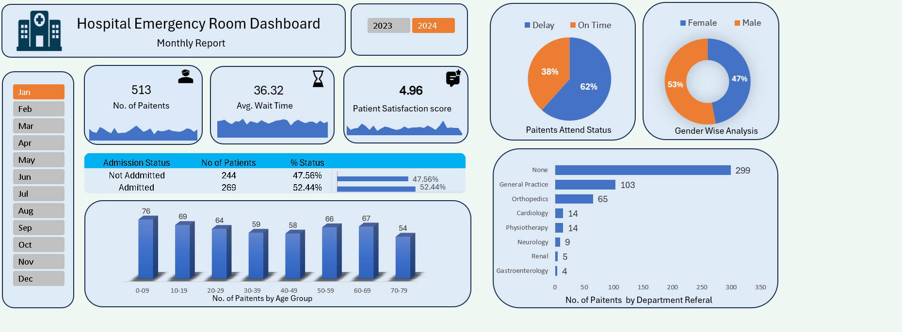

# Hospital Emergency Room Dashboard

### 1. Project Title / Headline
An interactive excel based healthcare dashboard built to
analyze emergency room patient visits, admission status, wait times,
satisfaction scores, age demographics, gender distribution, and department referrals.

### 2. Short Description / Purpose
The Hospital Emergency Room Dashboard provides a clear view of
513 patient visits across operational metrics and department referrals.

It helps analyze

total patient count

average wait time

patient satisfaction score

admission vs non-admission rates

patient attendance status (Delay vs On Time)

age group and gender demographics

department referral patterns.

### 3. Tech Stack
Microsoft Excel

Power Query – Data cleaning and transformation

Excel Formulas – Calculations and KPIs

Pivot Tables & Pivot Charts – Data analysis

Slicers – Interactive filtering (Monthly analysis)

Dashboard Design & Data Visualization

### 4. Data Set
The project uses an Emergency Room operations dataset
containing records of 513 patients processed through the ER department.

Key columns include:

Visit Month (Jan to Dec)

Admission Status (Admitted, Not Admitted)

Wait Time (Minutes)

Satisfaction Score (1 to 10 scale)

Patient Attend Status (On Time, Delay)

Gender (Male, Female)

Age & Age Group (09-10 to 70-79)

Department Referral (General Practice, Orthopedics, Physiotherapy, Cardiology, Neurology, Renal, Gastroenterology, None)

### 5. Features / Highlights

• Business Problem
Hospital administrative teams and ER heads struggle to monitor patient wait times, overcrowding factors, admission rates, and department bottleneck referrals directly from raw visit logs.

Key questions such as:
- What percentage of ER visits lead to hospital admissions versus discharge?
- How long are patients waiting on average, and what is the overall satisfaction score?
- Which department referrals account for the highest volume of ER patient volume?
...are difficult to answer quickly without unified interactive analytics.

• Goal of the Dashboard
To deliver an interactive visual tool that:
- Tracks key ER operational metrics (Total Patients, Avg Wait Time, Patient Satisfaction Score)
- Uncovers patient demographics, attend status punctuality, and admission ratios
- Supports clinical decision-making in ER staffing, wait-time reduction, and department referral routing.

• Walkthrough of Key Visuals
- Key KPIs
  - No. of Patients: 513
  - Avg. Wait Time: 35.26 mins
  - Patient Satisfaction Score: 4.96 / 10.0
- Filter Panel
  Interactive slicers enable filtering across Months (Jan through Dec).
- Admission Status (Data Table & Bar Chart)
  Shows admission distribution: Admitted accounts for 52.44% (269 patients), while Not Admitted accounts for 47.56% (244 patients).
- Patient Attend Status (Pie Chart)
  Displays arrival punctuality: Delay accounts for 62%, while On Time accounts for 38%.
- Gender Wise Analysis (Donut Chart)
  Highlights demographic gender distribution: Male accounts for 53%, while Female accounts for 47%.
- No of Patients by Age Group (Column Chart)
  Ranks patient age demographics: 09-10 (76), 10-19 (69), 60-69 (67), 50-59 (66), 20-29 (64), 30-39 (59), 40-49 (58), and 70-79 (54).
- No of Patients by Department Referral (Horizontal Bar Chart)
  Illustrates referral counts led by None (299), General Practice (103), Orthopedics (65), Physiotherapy (14), Cardiology (14), Neurology (9), Renal (5), and Gastroenterology (4).

### 6. Screenshots / Demos

